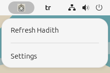
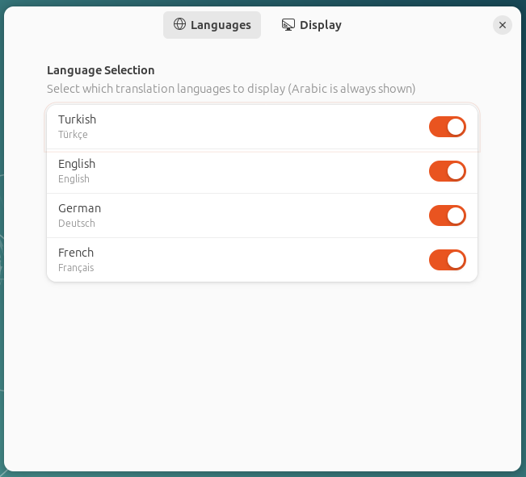
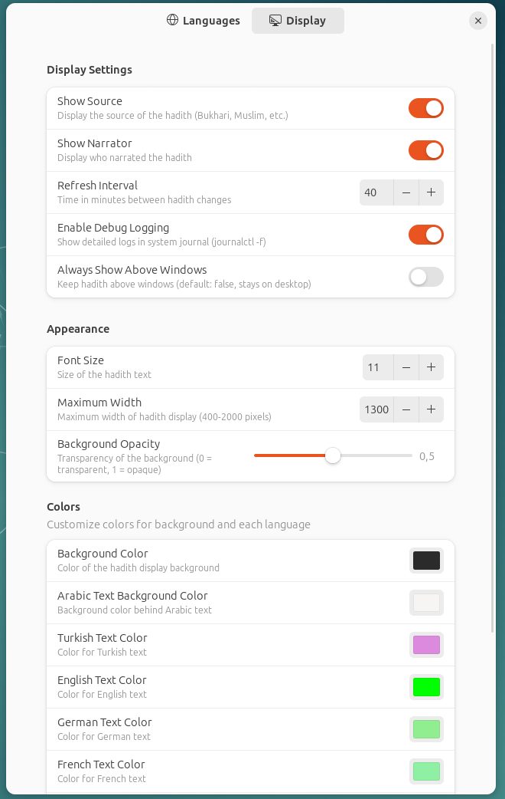

# Hadith GNOME Shell Extension



A GNOME Shell extension that displays random hadiths on your desktop with multi-language support.


## Features






- 🌍 **Multi-language Support**: Arabic, Turkish, English, German, and French
- 📚 **50 Hadiths**: Authentic hadiths from reliable sources (Bukhari, Muslim, etc.)
- 🔄 **Auto-refresh**: Configurable refresh interval (5 minutes to 24 hours)
- ⚙️ **Customizable Display**:
  - Toggle individual languages on/off
  - Show/hide Arabic text
  - Show/hide source information
  - Show/hide narrator information
  - Adjustable font size
  - Customizable background opacity
  - Position control
- 🎨 **Modern UI**: Clean, readable display with shadow effects

## Supported GNOME Versions

- GNOME 45
- GNOME 46
- GNOME 47
- GNOME 48
- GNOME 49

## Installation

### From Source

1. Clone this repository:
```bash
git clone https://github.com/faymaz/hadith.git
cd hadith
```

2. Compile the schema:
```bash
glib-compile-schemas schemas/
```

3. Copy to GNOME extensions directory:
```bash
mkdir -p ~/.local/share/gnome-shell/extensions/hadith@faymaz.github.com
cp -r * ~/.local/share/gnome-shell/extensions/hadith@faymaz.github.com/
```

4. Restart GNOME Shell:
   - X11: `Alt + F2`, type `r`, press Enter
   - Wayland: Log out and log back in

5. Enable the extension:
```bash
gnome-extensions enable hadith@faymaz.github.com
```

Or use GNOME Extensions app to enable it.

## Usage

After installation, the extension will automatically display a random hadith on your desktop. You can customize the behavior through the extension preferences:

1. Open GNOME Extensions app
2. Find "hadith" extension
3. Click the settings icon
4. Configure your preferences:
   - **Languages**: Select which languages to display
   - **Display**: Toggle source and narrator information
   - **Refresh Interval**: Set how often hadiths change
   - **Appearance**: Adjust font size and background opacity
   - **Position**: Set the location on your screen

## Data Structure

Each hadith in `hadith_list.json` contains:

```json
{
  "number": 1,
  "arabic": "Arabic text",
  "turkish": "Turkish translation",
  "english": "English translation",
  "german": "German translation",
  "french": "French translation",
  "source": "Source (e.g., Bukhari, Muslim)",
  "narrator": "Narrator/Companion name",
  "chain": "Chain of narration (optional)"
}
```

## Contributing

Contributions are welcome! Especially:

- ➕ Adding more hadiths to the collection
- 🌐 Improving existing translations
- 🐛 Bug reports and fixes
- ✨ Feature requests
- 📚 Adding additional hadith sources and references
- 🔍 Verifying and improving isnad (chain) accuracy

Please see `DEVELOPMENT_LOG.md` for the development history and guidelines.

## Database Completion Status

### Translations
- ✅ Arabic: 50/50 (100%)
- ✅ Turkish: 50/50 (100%)
- ✅ English: 50/50 (100%)
- ✅ German: 50/50 (100%)
- ✅ French: 50/50 (100%)

### Hadith Information
- ✅ Narrator (Rawi): 50/50 (100%)
- ✅ Chain (Isnad): 50/50 (100%)
- ✅ Source: 50/50 (100%)

**All 50 hadiths now have complete information including narrator chains from authentic Islamic sources!**

### Collection Highlights
- **Knowledge**: Hadiths about seeking and teaching knowledge (#41, #42, #43)
- **Ethics**: Hadiths about good speech, advice, and avoiding harm (#44, #46, #50)
- **Family**: Hadith about mothers and Paradise (#45)
- **Faith**: Hadiths about piety, purity, and halal/haram (#47, #48, #49)
- **Foundational**: All from Sahih Bukhari, Muslim, Abu Dawud, Tirmidhi, Nasa'i, Ibn Majah

## Support

If you find this extension useful, please consider:

- ⭐ Starring the repository
- ☕ [Buy me a coffee](https://www.buymeacoffee.com/fethiaymazb)
- 💖 [GitHub Sponsors](https://github.com/sponsors/faymaz)

## License

This project is open source. Please check the license file for details.

## Credits

- Hadith sources: Various authentic Islamic sources
- Extension developer: [@faymaz](https://github.com/faymaz)
- GNOME Shell Extension framework

## Links

- GitHub Repository: https://github.com/faymaz/hadith
- Report Issues: https://github.com/faymaz/hadith/issues
